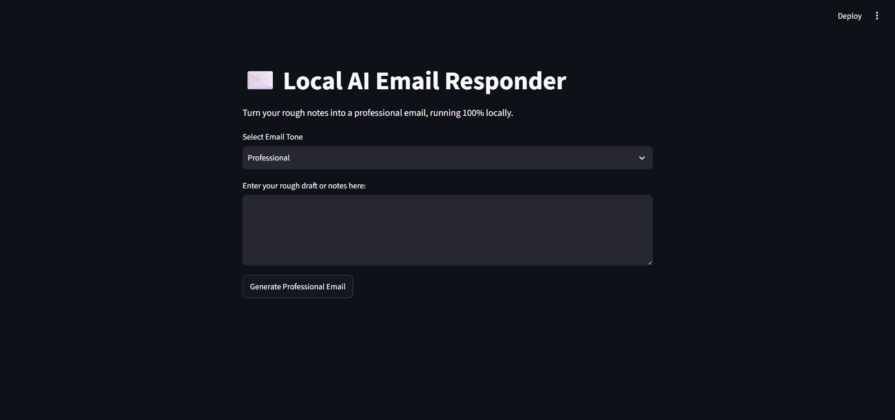
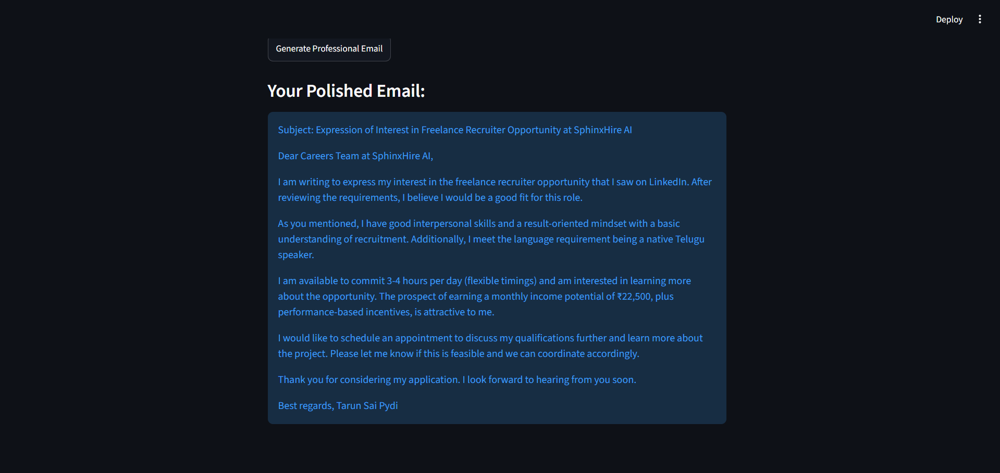

# ✉️ Local AI Email Assistant

> Transform rough notes into professional emails using a **100% local Large Language Model (LLM)** powered by **Ollama**, **Llama 3**, and **Streamlit**.


---

## 📌 Overview

Local AI Email Assistant is an end-to-end Generative AI application that generates polished, professional emails from rough user notes while keeping all processing completely local.

Unlike cloud-based AI assistants, this application runs entirely on your machine using **Ollama** and **Llama 3**, ensuring:

- 🔒 Complete privacy
- ⚡ Low latency
- 💰 Zero API costs
- 🌐 Offline capability

---

## ✨ Features

- ✍️ Convert rough notes into professional emails
- 🎯 Multiple email tones
  - Professional
  - Friendly
  - Apologetic
  - Direct
- 🤖 Local LLM inference using Ollama
- 💻 Interactive Streamlit interface
- ⚡ Fast response generation
- 🔐 Privacy-first architecture (No external API calls)
- ❌ Handles empty input and runtime errors gracefully

---

## 🏗️ Tech Stack

| Technology | Purpose           |
| ---------- | ----------------- |
| Python     | Backend           |
| Streamlit  | Web UI            |
| Ollama     | Local LLM Runtime |
| Llama 3    | Language Model    |

---

# 📷 Application Screenshots

## Home Screen



---

## Generated Email



---

## 📁 Project Structure

```
Local-AI-Email-Assistant/
│
├── app.py
├── requirements.txt
├── README.md
└── images/
    ├── home.png
    └── output.png
```

---

# ⚙️ Installation

## 1 Clone the repository

```bash
git clone https://github.com/TarunSaiPydi/LLM_Email_Assistant.git

cd LLM_Email_Assistant
```

---

## 2 Install Python dependencies

```bash
pip install -r requirements.txt
```

---

## 3 Install Ollama

Download Ollama from

https://ollama.com

---

## 4 Pull Llama 3

```bash
ollama pull llama3
```

---

## 5 Start Ollama

```bash
ollama serve
```

---

## 6 Run the application

```bash
streamlit run app.py
```

---

# 🚀 Usage

1. Launch the Streamlit application.
2. Select the desired email tone.
3. Enter rough notes or a draft.
4. Click **Generate Professional Email**.
5. Copy the AI-generated email.

---

# 🔄 Application Workflow

```
User Input
      │
      ▼
Select Email Tone
      │
      ▼
Prompt Engineering
      │
      ▼
Ollama
      │
      ▼
Llama 3
      │
      ▼
Professional Email
      │
      ▼
Displayed in Streamlit
```

---

# 💡 Example

### Input

```
Need leave tomorrow because fever.
```

### Output

```
Subject: Leave Request

Dear Manager,

I hope you are doing well.

I am writing to request leave for tomorrow as I am experiencing a fever and am not feeling well. I believe taking a day to rest will help me recover quickly.

Thank you for your understanding.

Kind regards,
John
```

---

# 📚 What I Learned

- Running LLMs locally using Ollama
- Prompt Engineering
- Streamlit application development
- Building Generative AI applications
- Error handling in AI applications
- Local inference without cloud APIs

---

# 🔮 Future Improvements

- Support multiple LLMs
- Email export (.docx / PDF)
- Email templates
- Email history
- Dark mode
- Voice-to-email generation
- Grammar correction mode
- One-click copy functionality

---

# 🤝 Contributing

Contributions, issues, and feature requests are welcome.

Feel free to fork the repository and submit a Pull Request.

---

# 📄 License

This project is licensed under the MIT License.

---

## 👨‍💻 Author

**Pydi Tarun Sai**

- LinkedIn: https://linkedin.com/in/tarun-sai-319378288
- GitHub: https://github.com/TarunSaiPydi

⭐ If you found this project helpful, consider giving it a star!
